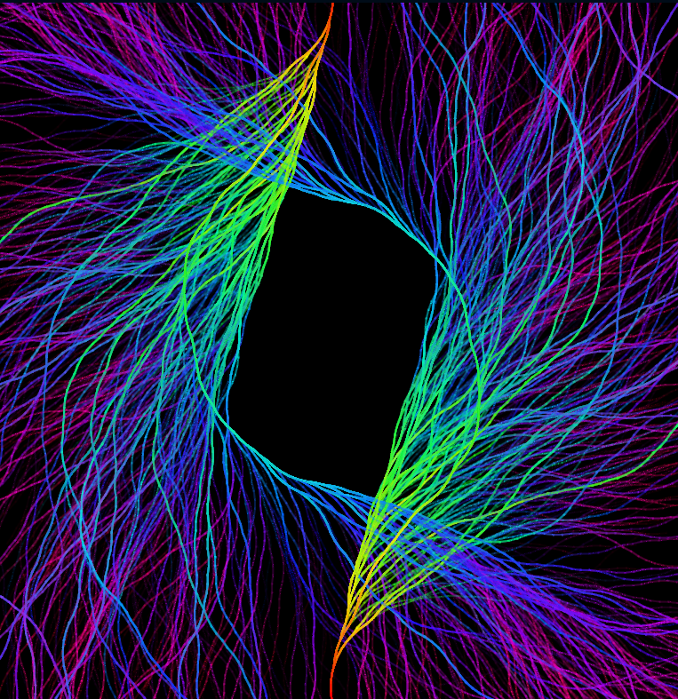
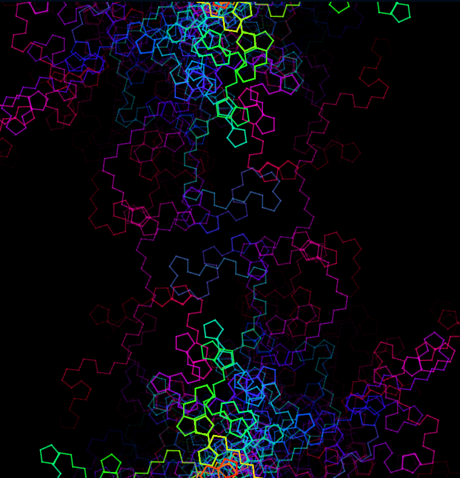

# Collatz Conjecture

## Introduction

This is a simulation of the [Collatz Conjecture](https://en.wikipedia.org/wiki/Collatz_conjecture). The Collatz Conjecture is a conjecture in mathematics that concerns a sequence defined as follows: start with any positive integer n. Then each term is obtained from the previous term as follows: if the previous term is even, the next term is one half of the previous term. If the previous term is odd, the next term is 3 times the previous term plus 1. The conjecture is that no matter what value of n, the sequence will always reach 1.

## Installation

To run the simulation, simply clone the repository and open the `index.html` file in your browser. Alternatively, you can visit the [GitHub Pages](https://ghostscypher.github.io/collatz_conjecture/src/index.html) for this repository.

## Explanation

The simulation starts with a random number between 1 and 1000. The simulation then calculates the next number in the sequence using the rules of the Collatz Conjecture. The simulation then draws a line from the current number to the next number. The simulation then repeats this process until the number 1 is reached.

## Implementation

### Pseudocode

```pseudocode
1. Generate a random number between 1 and 1000
1. While the number is not 1
    1. If the number is even
        1. Divide the number by 2
    2. Else
        1. Multiply the number by 3 and add 1
    3. Draw a line from the current number to the next number
```

## Using the simulation

The simulation is very simple to use. The simulation will start automatically when the webpage is loaded.

1. The simulation can be reset by pressing the `r` key.
2. The simulation can be paused by pressing the `p` key.
3. To visualize some interesting patterns in your browser console you can set the following variables
   - `angle` - The angle of the line drawn between the current number and the next number. A good value is 0.15. A good range is between 0.1 and 2
   - `len` - The length of the line drawn between the current number and the next number. A good value is 10. A good range is between 1 and 40
4. After setting the variables, press the `r` key to reset the simulation and see the new pattern. Do note that the new values the immediate effect on the simulation. The simulation will only show the new pattern after the simulation has been reset.

### Example with different angle and length

Note that the simulation reaches a sequence of 100000 in 152 steps.

**len** = `10`, **angle** = `0.12`



**len** = `20`, **angle** = `5`



## Demo


## References

1. [Collatz Conjecture](https://en.wikipedia.org/wiki/Collatz_conjecture)
2. [P5 JS](https://p5js.org/)
3. [P5 JS Reference](https://p5js.org/reference/)
4. [P5 JS Examples](https://p5js.org/examples/)
5. [P5 JS Web Editor](https://editor.p5js.org/)
6. [Coding train - P5 JS Tutorials](https://www.youtube.com/user/shiffman/playlists?view=50&sort=dd&shelf_id=14)
7. [The Nature of Code](https://natureofcode.com/)
8. [The Coding Train](https://thecodingtrain.com/)
9. [The Coding Train - Collatz Conjecture](https://www.youtube.com/watch?v=EYLWxwo1Ed8&t=21s&ab_channel=TheCodingTrain)
10. [p5 project - sequential chaos](https://editor.p5js.org/sequentialchaos/sketches/R3G_dBXzc)